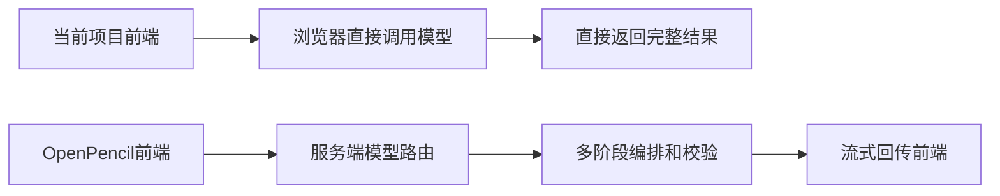

# pic2code 与 openpencil 的 AI 模型使用差异分析

## 一句话结论
`pic-2-code` 走的是“前端直接调模型”的轻量方案，部署简单、上手快，但模型管理、安全边界、扩展能力都比较薄。`openpencil` 走的是“前端发请求到服务端，再由服务端路由模型与工具链”的重型方案，接入复杂一些，但更适合长期演进成稳定的 AI 编辑器。

## 类比理解
可以把两者理解成两种餐厅出餐方式：

- `pic-2-code` 像开放式窗口，用户直接把需求递给后厨，菜做好后一次性端回来。
- `openpencil` 像有前台受理、后厨分单、质检复核的餐厅，流程更长，但更容易控质量、控权限、控扩展。

## 核心链路对比

## 关键区别
| 对比项 | pic2code | openpencil | 影响 |
| --- | --- | --- | --- |
| 模型来源 | `constants.ts` 里写死 `AVAILABLE_MODELS`，只支持 `gemini` 和 `openrouter` | 模型来自连接后的 Provider，前端只展示真实可用模型 | 前者简单但容易过期，后者真实但实现更复杂 |
| 调用位置 | `services/geminiService.ts` 直接在浏览器里调 `@google/genai` 或 `https://openrouter.ai/api/v1/chat/completions` | 前端统一走 `/api/ai/chat`、`/api/ai/generate`，服务端再分发到 Anthropic OpenAI OpenCode Copilot | 前者是直连，后者是中台 |
| 密钥与权限 | Gemini Key 通过 `vite.config.ts` 注入到前端，OpenRouter Key 由用户在设置面板输入 | 更偏向服务端或本地 CLI OAuth 管理，浏览器不直接握住所有模型凭据 | `openpencil` 的安全边界更清晰 |
| 返回方式 | 以一次性完整文本结果为主 | `streamChat` 使用 SSE 流式返回，并带超时 进度 thinking ping | `openpencil` 的交互反馈更细 |
| 图片处理 | 图片 base64 直接塞进 Gemini `inlineData` 或 OpenRouter `image_url` | 附件先进入统一消息结构，再按 Provider 能力适配，Claude 场景还会落临时文件给 Agent 读取 | `openpencil` 的多模态适配更完整 |
| 任务组织 | 主要是单轮生成 精修 转 React 转 Flutter 解释代码 | 有意图分类 编排器 子代理 并发 校验回路 任务报告 | `openpencil` 更像 AI 工作流系统 |
| 容错策略 | 失败直接抛错，重试和降级较少 | 强制显式传 `provider` 和 `model`，禁用隐式 fallback，并增加调试日志与报告 | 可观测性和可定位性更强 |

## 代码层面的直观差异
### pic2code
- `services/geminiService.ts` 里同时承担 Provider 选择 Prompt 组织 模型调用。
- `components/SettingsModal.tsx` 由用户直接切 Provider 和模型，并手填 Key。
- `vite.config.ts` 用 `define` 把 `GEMINI_API_KEY` 替成前端可读常量。

### openpencil
- `src/services/ai/ai-service.ts` 只负责前端请求与 SSE 解析，不直接碰模型 SDK。
- `server/api/ai/chat.ts` 是总路由口，按 `provider` 转到 Anthropic OpenCode Copilot 或 Codex 相关实现。
- `server/api/ai/connect-agent.ts` 会主动读取本地 CLI 或 SDK 的真实模型列表。
- `src/components/panels/ai-chat-handlers.ts` 先做意图分类，再决定走聊天还是设计生成。
- `src/services/ai/design-validation.ts` 会在生成后截图，再让模型做一轮视觉质检和修正。

## 对你当前项目的启发
如果你想让 `pic-2-code` 保持“纯前端可部署”的优势，可以继续保留直连方案，但至少建议补三件事：

1. 把模型适配层从 `geminiService.ts` 里拆出来，避免一个文件同时负责 Provider 路由 Prompt 和业务动作。
2. 不再把默认密钥直接注入前端，改成服务端代理或用户自带 Key，减少泄漏面。
3. 增加流式返回和最小可观测性，比如请求阶段状态 错误分类 请求报告。

如果你想把它升级成类似 `openpencil` 的产品级编辑器，那就应该继续往“服务端统一路由 多阶段编排 生成后校验”这条路走，而不是继续堆在前端直连逻辑上。

## 参考文件
- 当前仓库：`services/geminiService.ts`
- 当前仓库：`components/SettingsModal.tsx`
- 当前仓库：`vite.config.ts`
- `D:\NodejsP\openpencil\src\services\ai\ai-service.ts`
- `D:\NodejsP\openpencil\server\api\ai\chat.ts`
- `D:\NodejsP\openpencil\server\api\ai\connect-agent.ts`
- `D:\NodejsP\openpencil\src\components\panels\ai-chat-handlers.ts`
- `D:\NodejsP\openpencil\src\services\ai\design-validation.ts`

## 引用说明
- Google Gemini API 文档：https://ai.google.dev/docs
- OpenRouter Chat Completions 文档：https://openrouter.ai/docs/api-reference/chat-completion
- Anthropic Claude Code SDK 文档：https://docs.anthropic.com/en/docs/claude-code/sdk
- Vite 环境变量文档：https://vite.dev/guide/env-and-mode
- Vite define 配置文档：https://vite.dev/config/shared-options
