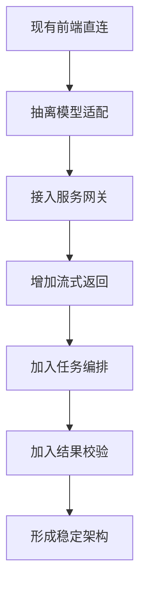

# pic2code 向 openpencil 架构迁移改造方案

## 目标
本方案的目标不是一次性把 `pic-2-code` 改成另一个项目，而是分阶段把它从“前端直连模型工具”升级成“可维护的 AI 生成平台”。核心方向有三条：

1. 降低前端里模型调用逻辑的耦合度。
2. 把模型密钥和 Provider 路由从浏览器挪到服务端边界。
3. 逐步补上流式返回 编排 校验和可观测性。

## 类比理解
可以把这次改造理解成“把路边小摊升级成中央厨房”。

- 现在的 `pic2code` 是一个人既接单又做菜还收银，速度快，但忙起来容易乱。
- 目标架构是前台接单 中台分单 后厨加工 质检复核，各环节更清楚，后续才好加菜单和扩人手。

## 迁移总路线

## 阶段一 先拆前端模型层
### 目标
先不改部署方式，先把 `services/geminiService.ts` 这个“大一统文件”拆开。

### 建议调整
- 新增 `services/ai/core/aiProvider.ts`，定义统一接口，例如 `generate` `refine` `explain`。
- 新增 `services/ai/providers/geminiProvider.ts`。
- 新增 `services/ai/providers/openRouterProvider.ts`。
- 新增 `services/ai/aiFacade.ts`，专门做 Provider 选择和参数归一化。
- 把 Prompt 常量继续留在 `constants.ts` 或单独迁到 `services/ai/prompts.ts`。

### 结果
这一步做完后，前端代码虽然还是直连模型，但后面接服务端时不需要重写全部业务调用点。

## 阶段二 增加最小服务网关
### 目标
把密钥和真实模型调用从浏览器挪到服务端。

### 建议调整
- 新增 `server/api/ai/generate.ts` 和 `server/api/ai/chat.ts`。
- 前端不再直接 import `@google/genai`，统一改成调用本地 API。
- 移除 `vite.config.ts` 里把 `GEMINI_API_KEY` 注入前端的做法。
- 设置层只保留“用户自带 Key”作为可选项，默认走服务端环境变量。

### 技术选择
- 如果你想快落地，可以先用 `Express` 或 `Hono` 做一个轻量 BFF。
- 如果你后面想更接近 `openpencil` 的组织方式，再迁到 `Nitro` 或 `h3`。

### 结果
这一步是安全边界的分水岭。完成后，前端从“直接碰后厨火源”变成“只负责下单”。

## 阶段三 增加流式返回
### 目标
把一次性整包返回，升级成可中断 可感知进度的流式交互。

### 建议调整
- 服务端 `chat` 接口使用 `SSE` 返回 `text` `error` `done` 事件。
- 前端新增 `services/ai/streamClient.ts`，专门解析流。
- UI 层补上生成中 停止生成 超时 错误类型展示。

### 验收标准
- 用户能看到边生成边输出。
- 用户可以主动中断。
- 模型长时间无响应时，界面能显示清晰超时信息。

## 阶段四 加入任务编排
### 目标
把当前“单次调用生成 HTML”的模式，升级成“分步骤完成任务”。

### 建议拆分
- 第一步 意图识别：判断是图片转代码 代码精修 代码解释 还是跨框架转换。
- 第二步 主生成：调用主模型生成结果。
- 第三步 后处理：清洗 Markdown 包裹 修复代码块格式 归一化输出。
- 第四步 可选复核：对结构异常 可访问性或布局问题做二次检查。

### 对应目录建议
- `services/ai/orchestrator.ts`
- `services/ai/taskTypes.ts`
- `services/ai/postProcessors.ts`
- `services/ai/runtimeConfig.ts`

### 结果
后续你要加 Vue Angular Figma DSL 或设计规范检查时，不会继续把逻辑塞回 `App.tsx`。

## 阶段五 加入结果校验
### 目标
学习 `openpencil` 的思路，但做适合当前项目的简化版。

### 建议方式
- 第一层做静态校验：HTML 结构 CSS 类名 代码块完整性。
- 第二层做规则校验：按钮缺少 `aria` 图片缺少 `alt` 响应式断点缺失。
- 第三层再考虑视觉校验：把生成结果截图，再交给视觉模型复查。

### 落地顺序
- 先做规则校验，因为成本最低。
- 再做截图对比，因为它最耗资源，也最容易引入调试成本。

## 阶段六 做可观测性和配置中心
### 目标
避免后面出现“模型换了但不知道哪里坏了”的情况。

### 建议补充
- 请求日志：记录 provider model duration status。
- 错误分类：区分超时 鉴权 限流 解析失败。
- 模型配置中心：不要再把所有模型写死在 `constants.ts`。
- 功能开关：是否启用流式 是否启用二次校验 是否允许用户自定义模型。

## 推荐实施顺序
1. 先做阶段一，拆服务层。
2. 再做阶段二，把 Key 和 Provider 路由收口到服务端。
3. 然后做阶段三，补流式返回。
4. 稳定后再做阶段四和阶段五。
5. 阶段六可以从第二阶段开始逐步补，不必最后一次性做完。

## 风险点
- 如果直接跳到服务端编排而不先拆前端接口，后续回归成本会很高。
- 如果继续把默认 Key 注入前端，安全问题会一直存在。
- 如果过早做视觉校验，调试成本可能会高于收益。

## 最小可执行版本
如果你想先做一轮最小升级，我建议第一批只做这四件事：

1. 拆 `geminiService.ts`。
2. 增加一个本地 `/api/ai/generate` 网关。
3. 去掉前端默认 Key 注入。
4. 为生成接口补超时和错误分类。

这四步做完，当前项目就已经从“演示型工具”进入“可持续维护工具”阶段了。

## 参考文件
- 当前项目：`services/geminiService.ts`
- 当前项目：`components/SettingsModal.tsx`
- 当前项目：`vite.config.ts`
- `D:\NodejsP\openpencil\src\services\ai\ai-service.ts`
- `D:\NodejsP\openpencil\server\api\ai\chat.ts`
- `D:\NodejsP\openpencil\server\api\ai\connect-agent.ts`
- `D:\NodejsP\openpencil\src\services\ai\design-validation.ts`

## 引用说明
- Google Gemini API 文档：https://ai.google.dev/docs
- OpenRouter 文档：https://openrouter.ai/docs
- Anthropic Claude Code SDK 文档：https://docs.anthropic.com/en/docs/claude-code/sdk
- Vite 环境变量文档：https://vite.dev/guide/env-and-mode
- Server Sent Events 说明：https://developer.mozilla.org/en-US/docs/Web/API/Server-sent_events
